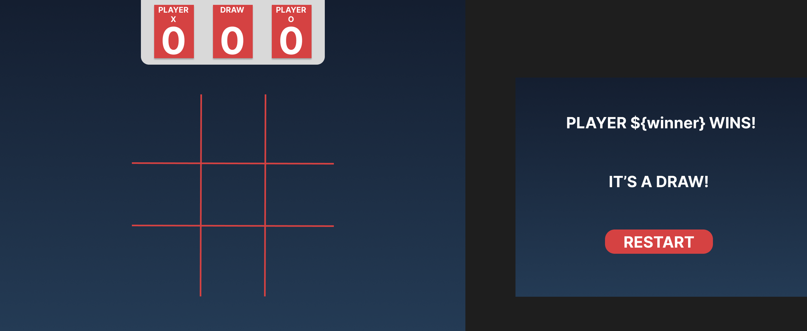

# tic-tac-toe

## Overview: 
> This is a project from [TheOdinProject](https://www.theodinproject.com)'s Full-Stack JS curriculum.

In this project I try to better organize my code better using, functions, factories, objects and concepts like closures and IIFE.

### Game Flow: 

- The game will have two players: 
    1. Human VS Human
    2. Human VS Computer
- Two player avatars: "X & O";
- The avatars will be assigned randomly to ensure the game is fair; 
- Whichever player gets their 3 of their avatar in a straight line, row, column or diagonally, wins. Else the game is recorded as a draw.
- After each round, the scoreboard is updated to reflect the outcome of the round.

### What I Tried: 

- Designed in figma "successfully" for the first time. It's ugly, yes I know. But I'm proud of it. Hoping to improve with time.

- // More coming...